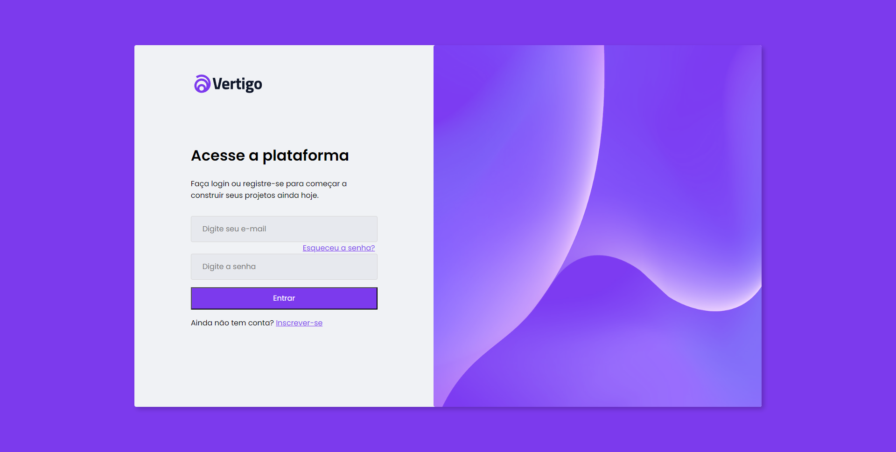
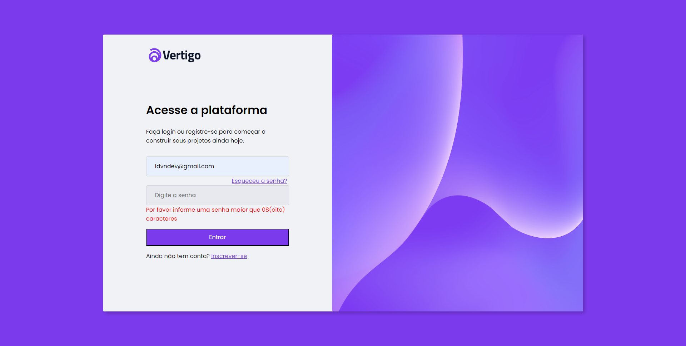
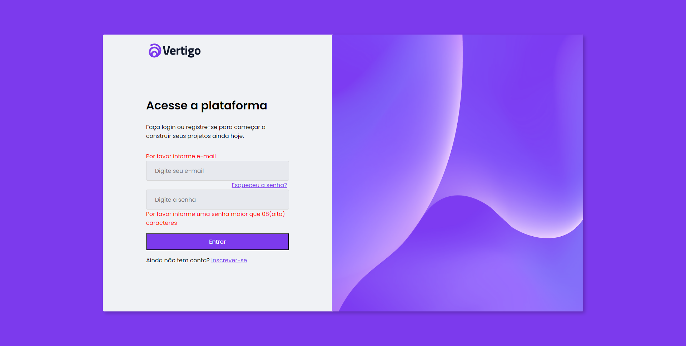

<h2>About the project</h2>
 
Page login <b>vertigo</b>

Credits for the design goes to <a href='https://www.figma.com/community/file/1217810469465160264'>Rocketseat and Jonas Milan</a>

👉 Live Demo: <a href='https://page-login-gamma.vercel.app'>Live Demo</a>

<h3>🔧 Tools:</h3>

» React JS 
» TypeScript 
» Zod 
» useForm 
» Styled Components 

<h2>Screenshots of the Project 📸</h2>
 
<h3 align='center'>Home Page 🏡</h3>

   
   
   
   

 
